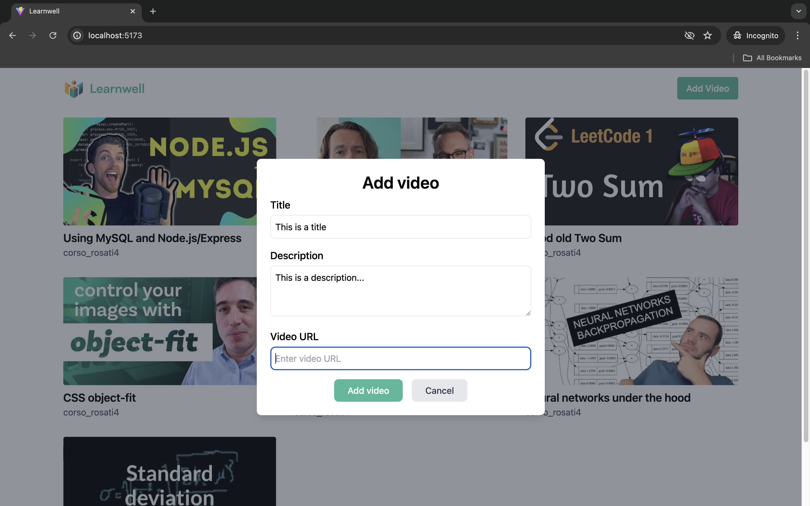
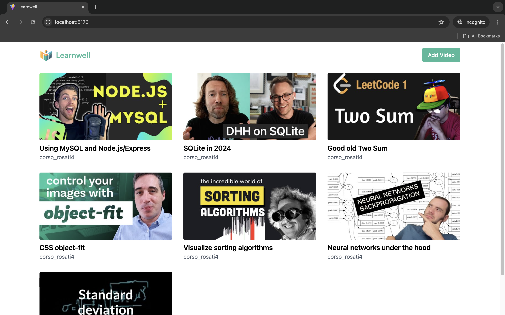
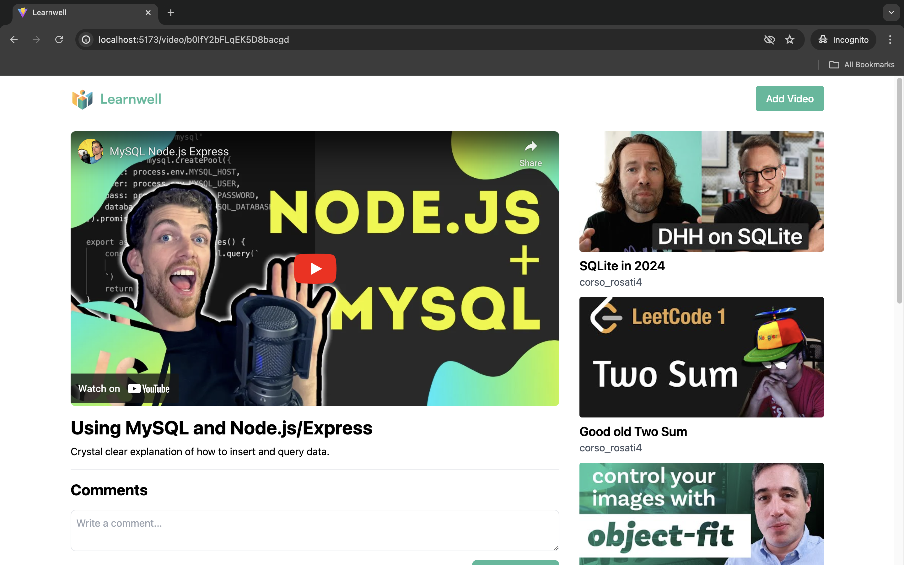
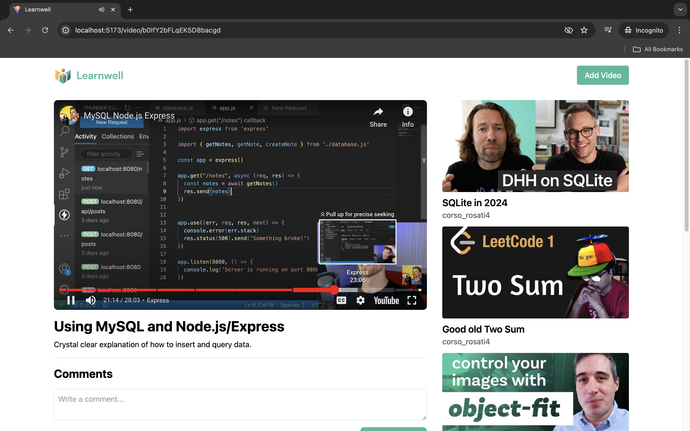
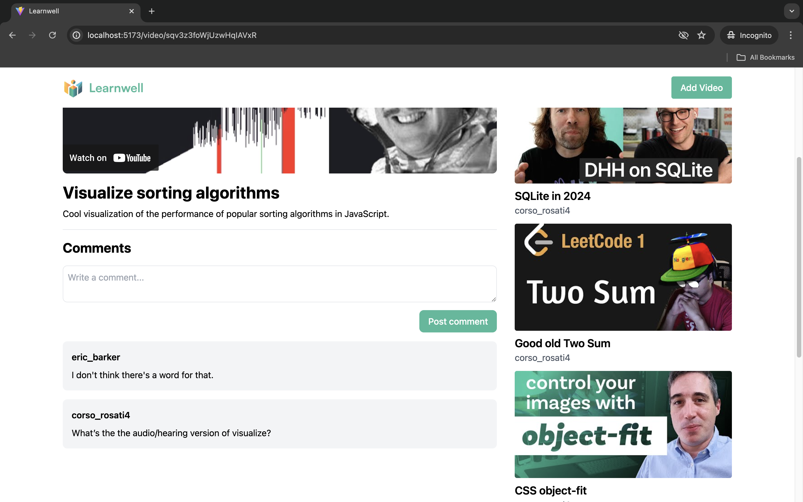

# Educational Video Player Showcase

## Overview 
The Learnwell web app allows users to add, select, view, and comment on educational videos. 

Learnwell supports videos from Youtube because it's easy to upload videos to and has good APIs. This approach is similar to Khan Academy's. 

The navigation bar has an "Add video" button that opens a modal for adding videos. 

The home page displays video previews of all the videos that have been added to Learnwell by the current user. 

The video page displays the video player and comments section for a selected video. It also displays a list of link previews for the rest of the videos. (I simulated comments from other users by manually changing the user_id.)

## Try it out 
1) git clone https://github.com/corsodr/learnwell.git
2) npm install
3) npm run dev or npm run build and npm run preview 

### Notes 
The user_name is set to corso_rosati4 because I used corso_rosati for testing purposes before realizing I couldn't delete data. I used a proxy to avoid CORS errors (see [vite.config.js](https://github.com/corsodr/learnwell/blob/main/vite.config.js))

## Screenshots 

### Add video modal 

### Home page 

### Video page 

### Video player 

### Video comments 

